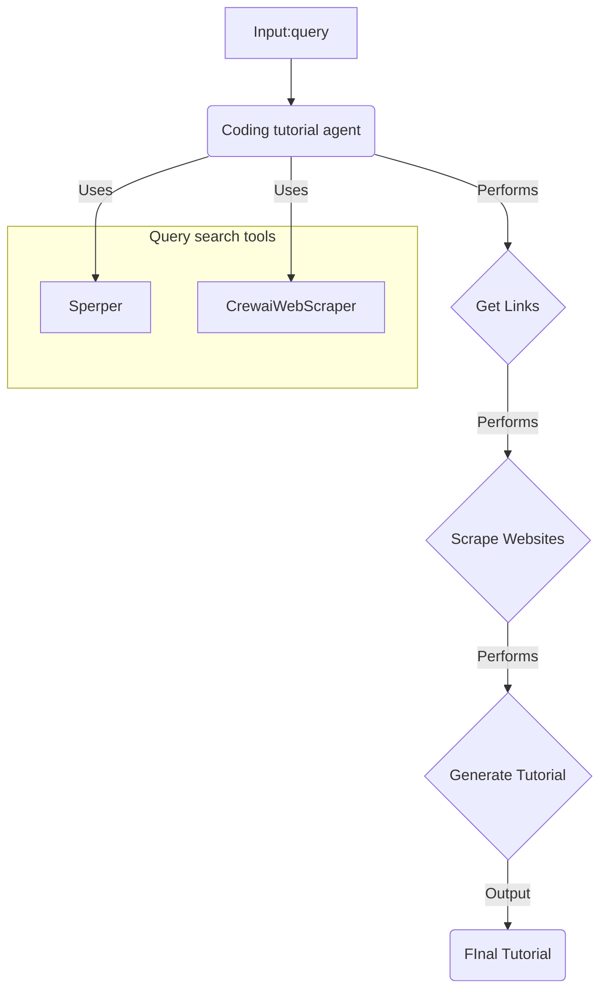

```mermaid
graph TD
    A[Input:query] --> B(Coding tutorial agent);

    subgraph "Query search tools"
        T1[Sperper]
        T2[CrewaiWebScraper]
    end

    B -- Uses --> T1;
    B -- Uses --> T2;

    B -->|Performs| F{Get Links};
    F -->|Performs| G{Scrape Websites};
    G -->|Performs| H{Generate Tutorial};
    H -->|Output| I(FInal Tutorial);
```
