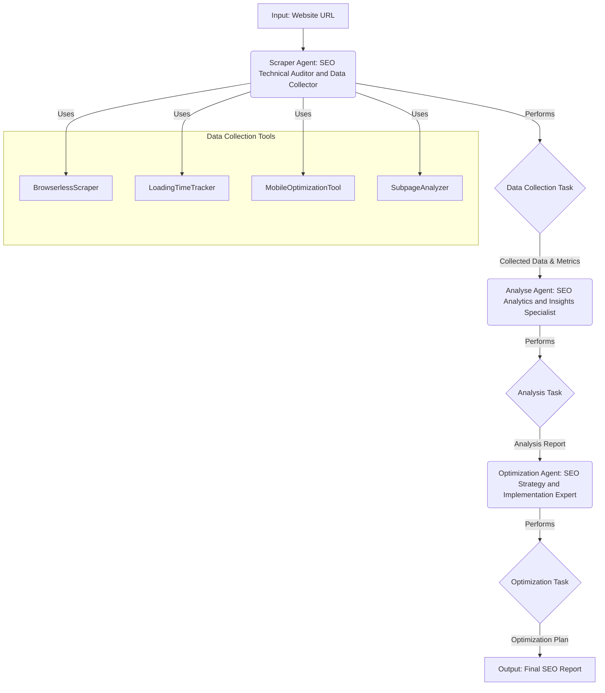

```mermaid
graph TD
    A[Input: Website URL] --> SA(Scraper Agent: SEO Technical Auditor and Data Collector);

    subgraph "Data Collection Tools"
        T1[BrowserlessScraper]
        T2[LoadingTimeTracker]
        T3[MobileOptimizationTool]
        T4[SubpageAnalyzer]
    end

    SA -- Uses --> T1;
    SA -- Uses --> T2;
    SA -- Uses --> T3;
    SA -- Uses --> T4;

    SA -- Performs --> DCT{Data Collection Task};
    DCT -- Collected Data & Metrics --> AA(Analyse Agent: SEO Analytics and Insights Specialist);
    AA -- Performs --> AT{Analysis Task};
    AT -- Analysis Report --> OA(Optimization Agent: SEO Strategy and Implementation Expert);
    OA -- Performs --> OT{Optimization Task};
    OT -- Optimization Plan --> FR[Output: Final SEO Report];
```
