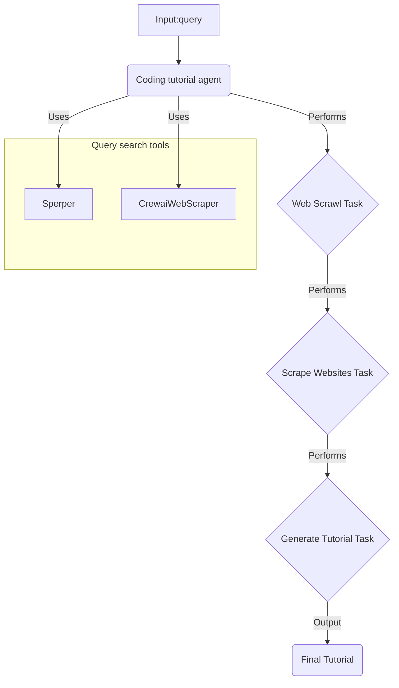

# Coding Tutorial Crew Workflow

This graph shows the initial `Input Query` get passed to the `Coding Tutorial Agent`, who then performs a web Crawl to gather relevant turoial links.

The `Coding Tutorial Agent` then Performs the `Scrape Website Task`, and uses the data as a knowledge base to perform the `Generate Tutorial Task` and create a tutorial based on the `Input Query`.

This tutorial is then returned as the `Final Tutorial`