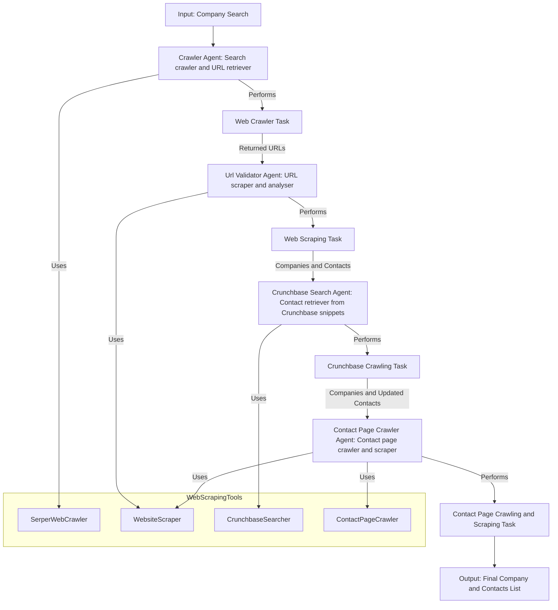

# Company Finder Crew Workflow

This diagram illustrates the workflow of the Company Finder Crew, detailing the agents, tasks, and the flow of information.

This graph shows the initial input (Company Search Query) being passed to the `Crawler Agent`. The `Crawler Agent` then performs the `Web Crawler Task` of the query and outputs the resulting URLS. 

These urls then get Scraped by the `URl Validator Agent` to ensure that the URLS are valid, to gather the company's name (especially if the URL redirects) and to check if a contact can be found in the URL, returning a list of `company names` and found `contact addresses`.

Companies without a found contact are handled by the `Crunchbase Search Agent`, performing the `Crunchbase Crawling Task` using the company URLS and finding any contact addresses in the result snippets.

Any companies that still do not have a found contact address are handled by the `Contact Page Crawler Agent`.
This performs a `Contact Page Crawling and SCraping Task` to search for and scrape possible contact pages for companies, which would have either a contact address or a form to contact the company.

The results all get appended to the `Original Company List` and the `Final Company and Contacts List` is outputted.