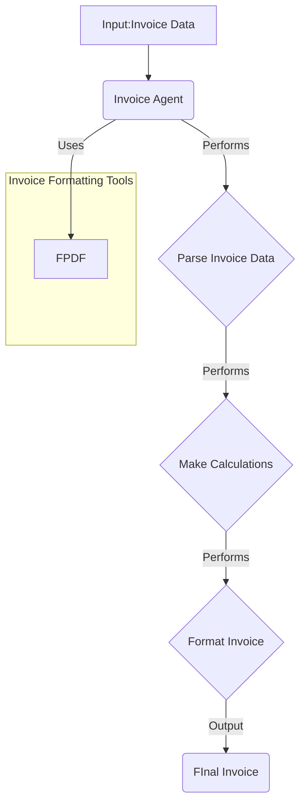

```mermaid
graph TD
    A[Input:Invoice Data] --> B(Invoice Agent);

    subgraph "Invoice Formatting Tools"
        T1[FPDF]
    end

    B -- Uses --> T1;

    B -->|Performs| F{Parse Invoice Data};
    F -->|Performs| G{Make Calculations};
    G -->|Performs| H{Format Invoice};
    H -->|Output| I(FInal Invoice);
```