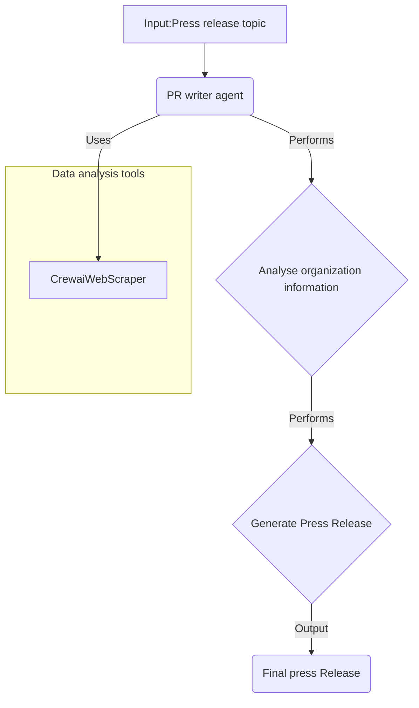

```mermaid
graph TD
    A[Input:Press release topic] --> B(PR writer agent);

    subgraph "Data analysis tools"
        T1[CrewaiWebScraper]
    end

    B -- Uses --> T1;

    B -->|Performs| F{Analyse organization information};
    F -->|Performs| G{Generate Press Release};
    G -->|Output| H(Final press Release);
```

Sample Work flow for the agent sequence