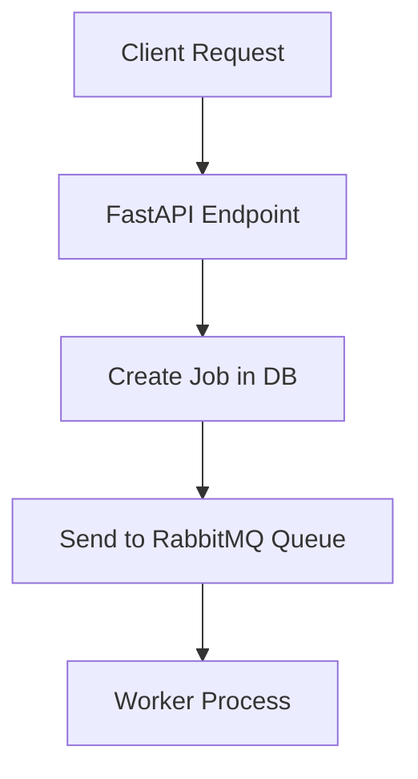
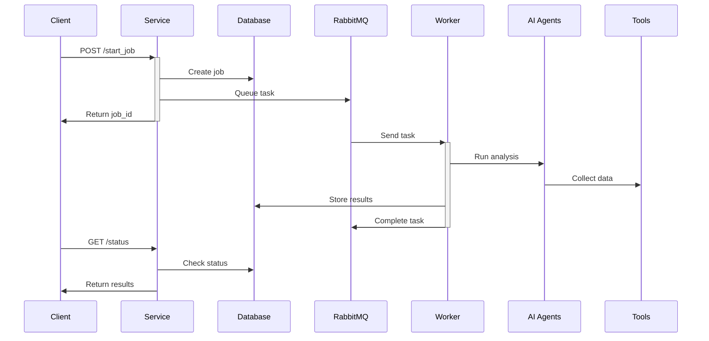

Let me explain the flow of this SEO analysis project:

1. **API Entry Point (service.py)**


2. **Main Components**:

- **FastAPI Service** (`service.py`):
  - Handles HTTP requests
  - Creates jobs in PostgreSQL
  - Sends tasks to RabbitMQ
  - Provides status updates

- **Database** (`db/database.py`):
  - Stores job information
  - Tracks job status
  - Stores analysis results
  - Manages metrics

- **Message Queue** (RabbitMQ):
  - Queues analysis jobs
  - Distributes work to workers
  - Handles job retries

- **Worker Process** (`crew.py`):
  - Runs the actual SEO analysis
  - Uses multiple AI agents
  - Collects data using various tools
  - Stores results in database

3. **Analysis Flow**:



4. **AI Agents** (in order of execution):

- **Scraper Agent**:
  - Collects raw website data
  - Uses BrowserlessScraper
  - Analyzes meta tags, content, links

- **Analysis Agent**:
  - Processes collected data
  - Calculates metrics
  - Identifies patterns

- **Optimization Agent**:
  - Generates recommendations
  - Creates action plans
  - Prioritizes fixes

5. **Tools Used**:

- `BrowserlessScraper`: Website content analysis
- `LoadingTimeTracker`: Performance measurement
- `MobileTesting`: Mobile compatibility
- `SubpageAnalyzer`: Deep page analysis

6. **Data Flow Example**:

```python
# 1. Client starts job
POST /start_job
{
    "website_url": "https://example.com"
}

# 2. Service creates job
INSERT INTO jobs (website_url, status) VALUES ('https://example.com', 'pending')

# 3. Worker processes job
crew = Crew(
    agents=[scraper_agent, analysis_agent, optimization_agent],
    tasks=[collect_data, analyze_data, create_recommendations]
)
result = crew.run()

# 4. Results stored
UPDATE jobs SET 
    status = 'completed',
    result = {...},
    completed_at = CURRENT_TIMESTAMP
WHERE id = job_id

# 5. Client gets results
GET /status?job_id=123
{
    "status": "completed",
    "recommendations": {
        "priority_fixes": [...],
        "impact_forecast": {...},
        "key_statistics": {...}
    }
}
```

7. **Error Handling**:
- Failed jobs are marked with error status
- Timeouts are handled gracefully
- Rate limiting for external services
- Retry mechanism for transient failures

8. **Monitoring**:
- RabbitMQ dashboard (port 15672)
- Database metrics
- Worker logs
- API health endpoint

This architecture allows for:
- Scalable processing (multiple workers)
- Asynchronous job handling
- Reliable data storage
- Real-time status updates
- Distributed load handling
