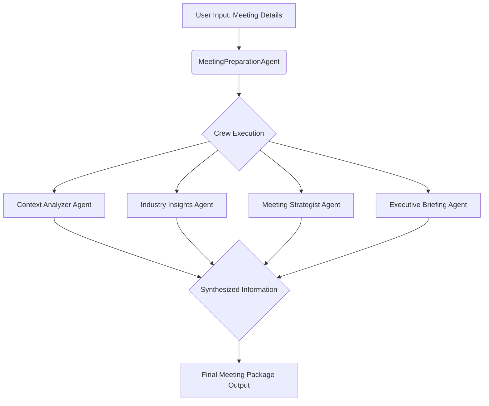

# Meeting Preparation Agent

The Meeting Preparation Agent is designed to assist in preparing comprehensive meeting packages using AI agents. It leverages various tools and APIs to gather and analyze information, providing detailed insights and strategies for effective meetings.

## Features

- **Context Analysis**: Analyzes the meeting context, including company background, recent developments, and relevant industry insights.
- **Industry Analysis**: Provides in-depth analysis of industry trends, competitive landscape, and potential opportunities.
- **Strategy Development**: Develops a tailored meeting strategy and agenda, including key talking points and discussion topics.
- **Executive Briefing**: Synthesizes information into a concise executive brief, including strategic recommendations and next steps.

## Workflow Overview

The agent orchestrates a crew of specialized AI agents to produce the meeting package. The general flow is as follows:



## Observability with Langfuse

This project is integrated with [Langfuse](https://langfuse.com/) for tracing and observability. This allows for detailed monitoring of the AI agent interactions, LLM calls, and overall workflow execution.

- **Traces**: Each run of the `prepare_meeting` method is traced, providing visibility into the sequence of operations, agent performance, and any errors.
- **LLM Calls**: Individual LLM calls made by the agents are captured, including model parameters, prompts, and responses.
- **Usage & Cost (Setup Required)**: Langfuse can track token usage and estimate costs for LLM calls. Ensure your Langfuse project has the correct model definitions and pricing configured for this feature to work accurately.

To enable Langfuse, ensure the following environment variables are set:
- `LANGFUSE_PUBLIC_KEY`
- `LANGFUSE_SECRET_KEY`
- `LANGFUSE_HOST`

The `MeetingPreparationAgent` is decorated with `@observe` and utilizes a `CallbackHandler` passed to the `ChatOpenAI` LLM to send data to Langfuse.

## Usage

The agent can be used via a simple command-line interface or by instantiating the `MeetingPreparationAgent` class. It requires API keys for OpenAI and Serper, which can be set as environment variables or passed directly to the agent. Langfuse keys are also required for tracing.

### Environment Variables
It's recommended to set the following environment variables (e.g., in a `.env` file):
- `OPENAI_API_KEY`
- `SERPER_API_KEY`
- `LANGFUSE_PUBLIC_KEY`
- `LANGFUSE_SECRET_KEY`
- `LANGFUSE_HOST` (e.g., `https://cloud.langfuse.com`)


### Example

```python
from agent_definition import MeetingPreparationAgent

# Ensure your .env file is loaded or environment variables are set
# for OPENAI_API_KEY, SERPER_API_KEY, LANGFUSE_PUBLIC_KEY, LANGFUSE_SECRET_KEY, LANGFUSE_HOST

agent = MeetingPreparationAgent(
    # API keys will be picked up from environment variables if not provided here
    # openai_api_key='your_openai_api_key', 
    # serper_api_key='your_serper_api_key',
)

result = agent.prepare_meeting(
    company_name="Masumi Network",
    meeting_objective="Discuss new marketing strategies for Sokosumi",
    attendees="Patrick Tobler, CEO\nKeanu Klestil, dev",
    meeting_duration=90,
    focus_areas="Market expansion opportunities and competitive analysis",
    reference_links=[
        "https://masumi.network/about",
        "https://dev.sokosumi.com",
        "https://sokosumi.com",
        "https://masumi.network"
    ]
)

print(result)
```

## Requirements

- Python 3.x
- `crewai`, `crewai_tools`, and other dependencies as specified in `requirements.txt`

## Installation

1. Clone the repository:
   ```bash
   git clone <repository-url>
   ```
2. Install the required packages:
   ```bash
   pip install -r requirements.txt
   ```

## License

This project is licensed under the MIT License.
