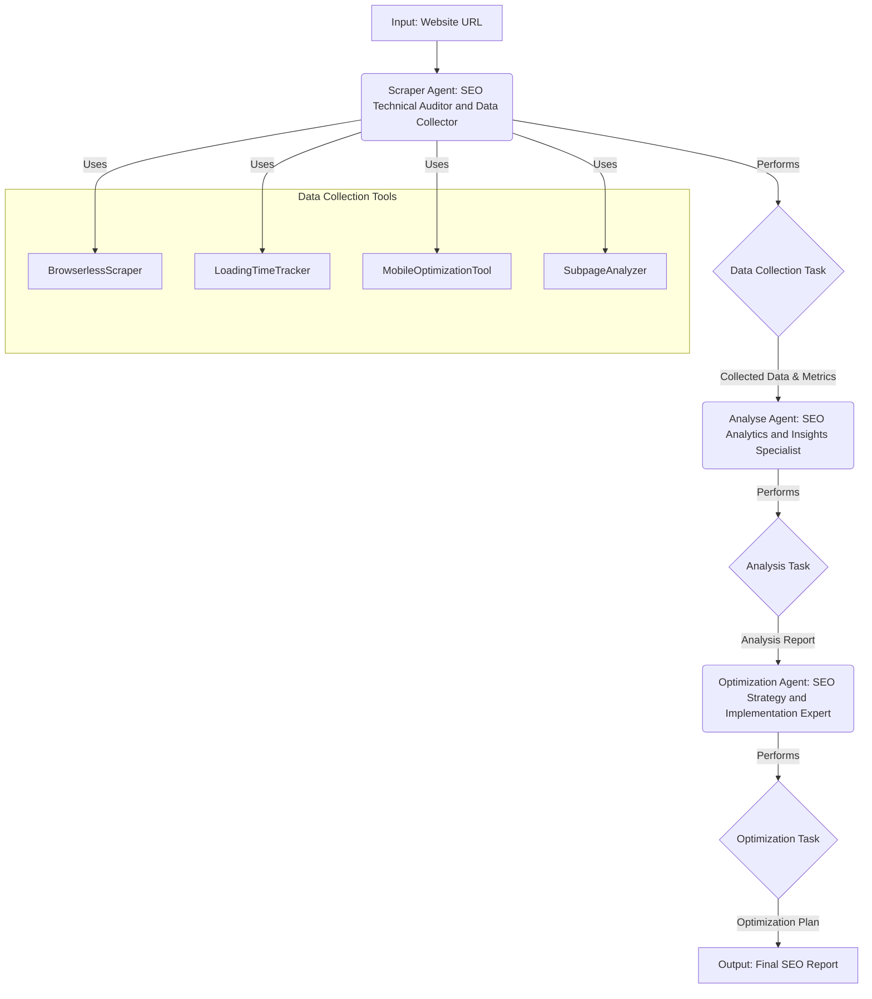

# SEO Analysis Crew Workflow

This diagram illustrates the workflow of the SEO Analysis Crew, detailing the agents, tasks, and the flow of information.

This graph shows the initial input (Website URL) going to the `Scraper Agent`. This agent uses its specialized tools to perform the `Data Collection Task`. The output of this task (Collected Data & Metrics) is then passed to the `Analyse Agent`, which performs the `Analysis Task`. The resulting `Analysis Report` is then used by the `Optimization Agent` to perform the `Optimization Task`, which finally produces the `Final SEO Report`.
